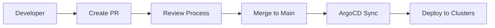

# GitOps Repository Structure for Velero Manager

## Overview

This document defines the Git repository structure for managing backup configurations in a GitOps workflow with ArgoCD.

## Repository Structure

```
velero-gitops-config/
├── README.md
├── environments/
│   ├── production/
│   │   ├── clusters/
│   │   │   ├── prod-cluster-01/
│   │   │   │   ├── backup-schedules/
│   │   │   │   │   ├── daily-full-backup.yaml
│   │   │   │   │   ├── hourly-incremental.yaml
│   │   │   │   │   └── weekly-retention.yaml
│   │   │   │   ├── storage-locations/
│   │   │   │   │   └── prod-s3-storage.yaml
│   │   │   │   └── velero-config/
│   │   │   │       ├── install.yaml
│   │   │   │       └── rbac.yaml
│   │   │   └── prod-cluster-02/
│   │   │       └── ... (same structure)
│   │   └── shared/
│   │       ├── storage-classes/
│   │       ├── backup-policies/
│   │       └── alert-rules/
│   ├── staging/
│   │   └── ... (same structure as production)
│   └── development/
│       └── ... (same structure as production)
├── templates/
│   ├── backup-schedules/
│   │   ├── daily-backup-template.yaml
│   │   ├── weekly-backup-template.yaml
│   │   └── disaster-recovery-template.yaml
│   ├── storage-locations/
│   │   ├── aws-s3-template.yaml
│   │   ├── minio-template.yaml
│   │   └── azure-storage-template.yaml
│   └── cronjobs/
│       ├── backup-orchestration-template.yaml
│       └── token-rotation-template.yaml
├── argocd-apps/
│   ├── bootstrap/
│   │   └── root-app.yaml
│   ├── environments/
│   │   ├── production-apps.yaml
│   │   ├── staging-apps.yaml
│   │   └── development-apps.yaml
│   └── cluster-apps/
│       ├── prod-cluster-01-app.yaml
│       ├── prod-cluster-02-app.yaml
│       └── ...
└── docs/
    ├── deployment-guide.md
    ├── backup-policy-guide.md
    └── troubleshooting.md
```

## Directory Explanations

### `/environments/`

Environment-specific configurations organized by deployment stage.

#### `/environments/{env}/clusters/{cluster-name}/`

Per-cluster backup configurations including:

- **backup-schedules/**: Velero Schedule CRDs for this cluster
- **storage-locations/**: BackupStorageLocation configurations
- **velero-config/**: Velero installation and RBAC manifests

#### `/environments/{env}/shared/`

Cross-cluster configurations that apply to the entire environment:

- **storage-classes/**: Kubernetes StorageClass definitions
- **backup-policies/**: Organization-wide backup policies
- **alert-rules/**: Prometheus alerting rules for backups

### `/templates/`

Reusable YAML templates that can be customized per environment:

- **backup-schedules/**: Standard backup schedule patterns
- **storage-locations/**: Storage backend templates
- **cronjobs/**: Orchestration CronJob templates

### `/argocd-apps/`

ArgoCD Application definitions that manage the GitOps deployment:

- **bootstrap/**: Root ArgoCD app-of-apps pattern
- **environments/**: Environment-level application definitions
- **cluster-apps/**: Individual cluster application definitions

## File Naming Conventions

### Backup Schedules

```
{frequency}-{scope}-{retention}.yaml

Examples:
- daily-full-30day.yaml
- hourly-incremental-7day.yaml
- weekly-disaster-recovery-365day.yaml
```

### Storage Locations

```
{provider}-{environment}-{region}.yaml

Examples:
- aws-s3-prod-us-east-1.yaml
- minio-dev-local.yaml
- azure-staging-westus2.yaml
```

### Clusters

```
{environment}-cluster-{number}

Examples:
- prod-cluster-01
- staging-cluster-01
- dev-cluster-01
```

## GitOps Workflow

### 1. Change Process



### 2. Branch Strategy

- **main**: Production-ready configurations
- **feature/\***: New backup policies or cluster additions
- **hotfix/\***: Emergency backup configuration fixes
- **environment/\***: Environment-specific testing

### 3. Approval Process

- **Development**: Auto-merge after CI checks
- **Staging**: Require 1 reviewer approval
- **Production**: Require 2 reviewer approvals + security review

## Configuration Examples

### Backup Schedule Example

```yaml
# environments/production/clusters/prod-cluster-01/backup-schedules/daily-full-backup.yaml
apiVersion: velero.io/v1
kind: Schedule
metadata:
  name: daily-full-backup
  namespace: velero
  labels:
    cluster: prod-cluster-01
    environment: production
    backup-type: full
spec:
  schedule: '0 2 * * *' # Daily at 2 AM
  template:
    metadata:
      labels:
        scheduled-by: velero-manager
        retention: '30d'
    spec:
      includedNamespaces:
        - production
        - monitoring
        - ingress-nginx
      ttl: 720h0m0s # 30 days
      storageLocation: prod-s3-storage
```

### ArgoCD Application Example

```yaml
# argocd-apps/cluster-apps/prod-cluster-01-app.yaml
apiVersion: argoproj.io/v1alpha1
kind: Application
metadata:
  name: velero-prod-cluster-01
  namespace: argocd
  finalizers:
    - resources-finalizer.argocd.argoproj.io
spec:
  project: velero-backup-management
  source:
    repoURL: https://github.com/your-org/velero-gitops-config
    targetRevision: main
    path: environments/production/clusters/prod-cluster-01
  destination:
    server: https://prod-cluster-01.example.com:6443
    namespace: velero
  syncPolicy:
    automated:
      prune: true
      selfHeal: true
      allowEmpty: false
    syncOptions:
      - CreateNamespace=true
    retry:
      limit: 5
      backoff:
        duration: 5s
        factor: 2
        maxDuration: 3m
```

## Security Considerations

### 1. Repository Access

- **Read Access**: All cluster operators, developers
- **Write Access**: Platform team, backup administrators
- **Admin Access**: Platform team leads, security team

### 2. Sensitive Data Handling

- **Secrets**: Use Sealed Secrets or External Secrets Operator
- **Credentials**: Store in secure secret management system
- **Tokens**: Auto-rotate via CronJob, never commit to Git

### 3. Branch Protection

- **main branch**: Require PR reviews, status checks
- **environment branches**: Environment-specific protection rules
- **Signed commits**: Require GPG signature for production changes

## Integration with Velero Manager UI

### 1. UI to Git Workflow

```
User Action (UI) → Generate YAML → Create Git PR → ArgoCD Sync → Cluster Deployment
```

### 2. UI Features

- **Visual Schedule Builder**: Generates schedule YAML
- **Cluster Onboarding**: Creates full cluster directory structure
- **Policy Templates**: UI selection → YAML generation
- **Approval Dashboard**: Review and approve Git PRs

### 3. Real-time Status

- **ArgoCD Integration**: Show sync status in UI
- **Git Integration**: Display PR status and history
- **Cluster Health**: Real-time backup status across all clusters

## Migration from CronJob Architecture

### 1. Export Current Configurations

```bash
# Export existing CronJobs to Git repository structure
velero-manager export --format=gitops --output=./velero-gitops-config/
```

### 2. Gradual Migration

- **Phase 1**: Parallel operation (CronJobs + GitOps)
- **Phase 2**: Cluster-by-cluster migration
- **Phase 3**: Deprecate CronJob orchestration

### 3. Rollback Strategy

- **Git Revert**: Roll back configuration changes
- **ArgoCD Rollback**: Point-in-time application rollback
- **Emergency**: Fall back to CronJob orchestration

## Monitoring and Observability

### 1. GitOps Metrics

- **Sync Success Rate**: ArgoCD application sync metrics
- **Drift Detection**: Configuration drift alerts
- **Deployment Time**: Time from Git commit to cluster deployment

### 2. Backup Metrics

- **Schedule Compliance**: Backups running on schedule
- **Success Rates**: Backup completion metrics
- **Storage Usage**: Cross-cluster storage consumption

### 3. Security Metrics

- **Access Auditing**: Git repository access logs
- **Change Tracking**: All configuration changes via Git history
- **Policy Compliance**: Backup policy adherence metrics

---

This repository structure provides a robust foundation for GitOps-managed backup operations across multiple Kubernetes clusters with full audit trails, approval processes, and automated deployment via ArgoCD.
